# SLAM

_Simultaneous Localization and Mapping_

## Primary Topics
- Localization:
    - The robot estimates its position using perceived information and a map
    - The map might be known (localization)
    - The map might unknown but then built in parallel (SLAM)
- Challenges:
    - Measurements and the map are prone to error: the robot must deal with uncertain information!
        - "Probabilistic map-based localization

### Localization:
- The robot wakes up and senses the environment
    - All possible locations are equally known - the probability of being anywhere is uniformly distributed.
- As soon as something in the environment is detected (i.e a landmark), the probability of its localization
  can be updated.
- The general algorithm is: see -> act -> see -> act -> ...
    - The "belief" of where the robot is hopefully improves during this process (through information fusion)
        - Robot has a uniform distribution of where it might be
        - It senses a pillar (it knows where other pillars might be through the known map)
        - It moves a distance (not perfectly known since wheels might slip or other disturbances introduce noise)
        - It senses again and sees another pillar nearby
        - A peak in between two local pillars is observed in the probabilities of where the robot might be

- Belief representations
    - Continuous Map with single hypothesis probability distribution, _p(x)_
        - Kalman Filter Localization
    - Continuous Map with multiple hypothesis probability distribution, _p(x)_
    - Discretized metric map (grid _k_) with probability distribution, _p(k)_
        - Markov Localization
    - Discretized topological map (nodes _n_) with probability distribution, _p(n)_

## Resources:
    - https://learning.edx.org/course/course-v1:ETHx+AMRx+2T2020/block-v1:ETHx+AMRx+2T2020+type@sequential+block@0ea670931d934964bd320211216ed093/block-v1:ETHx+AMRx+2T2020+type@vertical+block@785f45125af7478f88629e254d1d74a8
    - https://ieeexplore.ieee.org/stamp/stamp.jsp?tp=&arnumber=1638022
    - https://mermaid.live/edit#pako:eNp1kkFrwzAMhf-K0KmDlN5zGIy2twUK7U7zGKqttIY6DrYzGGn--5S4paNbc7Es9D4_P6dH7Q1jiYdA7RF2K9WAfK2PNlnffHatocTvCjeXDrxNHZhxTNbR2FrUXZTlSeEHzOfPcL6qz0A6ZaAUAnlZ7kqo_MSZOZ98iAtuRgch_pIHNlYnNnADOWozSAoBVdTCTHwQ7Cnyf1K_jxy-Jn9xlCd9tM3hysi7vroUQ1ZP_T_auywyIvIYyna9LmHDQXOb77Qkx4EKeBVXoQBO-ubNMcUuTPiHziSmxxncGcEC5TBH1sjz9aNeYTqyY4WllIZr6k5JoWoGGc2atbESOpY1nSIXSF3y2-9GY5lCx9ehlSX5G9xlavgBv3-_Vw
